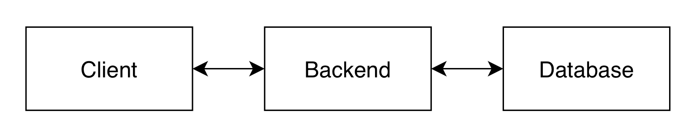
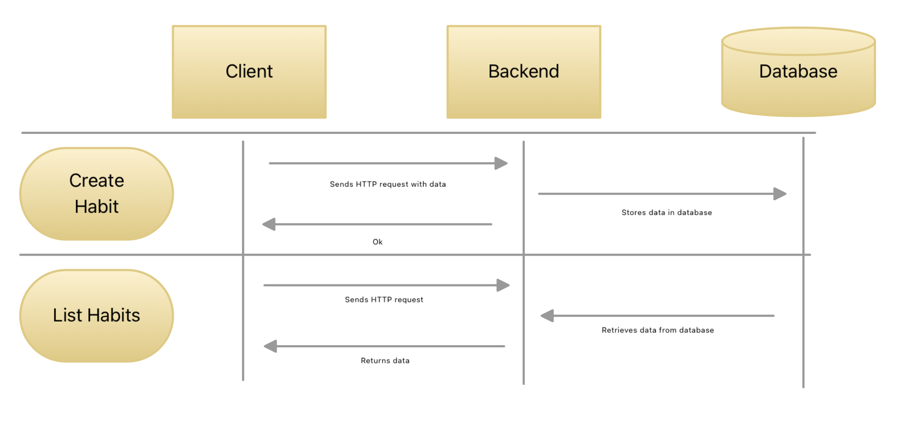

# Habit Tracker Proposal

## Technical Requirements

Following is a list of technical requirements

### Application Architecture Decision

#### Options

1. Run the program and interact with the main loop
2. Run a backend and have a separate client interacting with the backend

#### Considerations

Option 1 will allow for initial easier development, but might cause problems later down the line if requirements are altered, or futher expansion of the system is needed. Option 2 allows for better flexibility in the future in case a GUI or alternative frontends are needed, and will increase isolation of the applications. 

#### Conclusion

Option 2: Run a backend and have a separate client interacting with the backend

### Data Storage

#### Options

1. Json file
2. SQLite database
3. MongoDB, MySQL or PostgreSQL

#### Considerations

Json is a standard information transfer format and is widely used on the web, the downside is that we will need to recreate what a database already has implemented when we want to adjust data. SQLite is a part of the standard library, and although it requires knowledge of SQL, this is also widely standardized not creating a barrier of future team members and development. A database also scales better than a Json file. Using a fully fledged database like MongoDB is future proofing and scales well, however it is an overkill for the requirements for this app.

#### Conclusion

Option 2: SQLite database

### Data Schemas

We should store Habits as config objects. We should then use a separate structure called Tasks, that links back to the Habits, that we can mark as complete or not. This way we separate the Habits information, and the tracking of the individual events, and we reduce the amount of duplicate data. 

Every time the a Habit is hitting its selected interval, a new Task is created with a deadline. If completed, the task will be marked as such.

### User Interaction

#### Options

1. CLI
2. System GUI
3. Web App 

#### Considerations

Options 2 and 3 requires an extra design step which may consume the majority of the project time. Although it is easier for the user to interact with shiny buttons, this is not in the POC requirements, and therefore should not be taken into account. Option 1 is simple and available for use on any machine, although it requires more extensive documentation than the other two options.

#### Conclusion

Option 1: CLI 

### Backend Web Framework

#### Options

1. Flask
2. Django
3. None

#### Considerations

Option 3, to not use any framework, may cause unecesary creation of helper code. It is therefore not preferred. Option 1 and 2 are more or less the same, but after searching up tutorials and documentation, option 1 seems to have the most tutorials and the easiest barrier of entry.

#### Conclusion

Option 1: Flask 

## Flow and Interractions

The user will start the backend, which will then initialize the SQLite database file. The user will then use the provided CLI to interact with the backend, using HTTP requests.

The following diagram shows the high level relationship between the components

This is the more detailed flow of individual requests 

